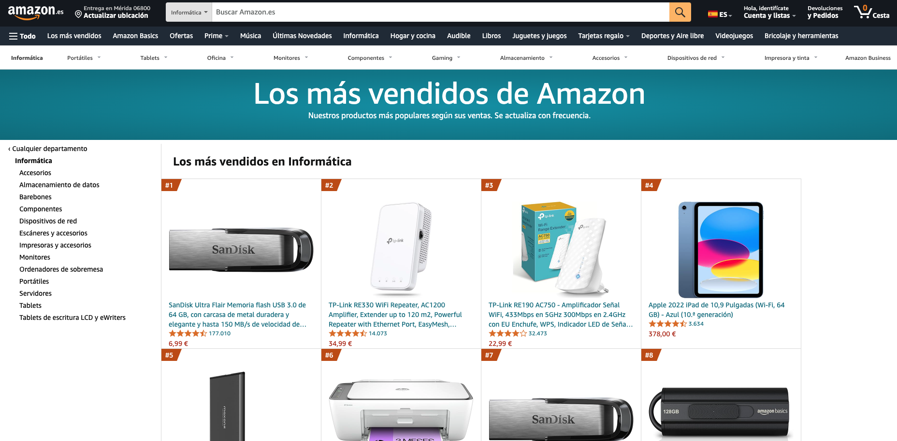

### Patrones de Diseño de Interfaces

Los patrones ofrecen soluciones efectivas a problemas comunes en el desarrollo de interfaces de usuario. Aplicamos estos patrones para crear interfaces más intuitivas y consistentes, adaptando experiencias previas a nuevos contextos y asegurando una excelente experiencia de usuario. A continuación, os mostraré los principales patrones y cómo los aplicamos en diferentes escenarios.

### Principales Patrones de Diseño

Aquí os explico los patrones más comunes que utilizamos para mejorar la usabilidad en nuestros proyectos:

| **Patrón**                  | **Descripción**                                                                                                                                     |
|-----------------------------|-----------------------------------------------------------------------------------------------------------------------------------------------------|
| **Barra de Navegación**      | Proporciona acceso a las distintas secciones de la interfaz, ya sea horizontal o vertical, a menudo incluye menús desplegables para mayor accesibilidad. |
| **Breadcrumbs (Migas de Pan)**| Muestra una ruta de navegación para que los usuarios conozcan su ubicación dentro de la estructura de la aplicación o sitio web.                     |
| **CTA (Call to Action)**     | Botones que invitan a realizar acciones como "Comprar ahora" o "Suscribirse". Estos son elementos clave para guiar a los usuarios hacia sus objetivos. |
| **Cards (Tarjetas)**         | Organizan contenido de forma compacta, como productos, artículos o perfiles, proporcionando una vista rápida y accesible del contenido disponible.      |
| **Modal Windows**            | Ventanas emergentes que ofrecen información adicional o requieren una acción, como confirmar una compra o aceptar términos.                           |
| **Infinite Scroll**          | Carga automáticamente más contenido a medida que el usuario se desplaza, ideal para sitios con mucho contenido como redes sociales o tiendas online.   |
| **Tabs (Pestañas)**          | Organizan el contenido en secciones dentro de la misma página, facilitando el acceso a múltiples vistas sin recargar la interfaz.                     |

---

### Aplicación de Patrones en Diferentes Contextos

A continuación, os muestro cómo estos patrones se adaptan a diversos contextos:

- **E-commerce**  
  Utilizamos **Tarjetas** para presentar productos y **CTA** para guiar al usuario a la compra. Las **Migas de Pan** facilitan la navegación entre categorías.  

- **Redes Sociales**:  
  En aplicaciones de redes sociales aplicamos **Infinite Scroll** para mostrar contenido continuamente, mientras que las **Tarjetas** son útiles para mostrar publicaciones.  

- **Gestión Empresarial (ERP/CRM)**:  
  Usamos **Pestañas** para organizar las diferentes áreas (Ventas, Inventario, Informes) y **Ventanas Modales** para confirmar acciones críticas.  

- **Sistemas de Información de Salud**:  
  En estos sistemas, las **Pestañas** permiten organizar la información médica, mientras que las **Ventanas Modales** ayudan a confirmar la introducción de datos.  

- **Aplicaciones Móviles**:  
  Dado el espacio limitado de la pantalla, las **Tarjetas** compactas y los **CTA** claros son esenciales. Además, el **Infinite Scroll** mejora la experiencia continua.  

### Aplicación de Patrones en la Imagen

En la imagen proporcionada, he identificado los siguientes elementos:

1. **Barra de Navegación**:  
    - La barra de navegación está ubicada en la parte superior de la página y ofrece acceso a diferentes secciones, como "Todo", "Los más vendidos", "Amazon Basics", entre otros.

2. **Breadcrumbs (Migas de Pan)**:  
    - En esta vista específica de la página, no parece haber migas de pan visibles.

3. **CTA (Call to Action)**:  
    - Aunque no hay botones específicos de "Comprar ahora" o "Suscribirse", el botón de búsqueda cumple una función importante como CTA.

4. **Cards (Tarjetas)**:  
    - Los productos listados, como la memoria USB SanDisk y el repetidor TP-Link, están organizados en tarjetas individuales que incluyen imágenes, descripciones y precios.

5. **Modal Windows**:  
    - En la imagen no se observan ventanas emergentes.

6. **Infinite Scroll**:  
    - No es posible determinar desde la imagen si el sitio utiliza desplazamiento infinito.

7. **Tabs (Pestañas)**:  
    - No hay pestañas evidentes en esta vista de la página.

Estos elementos son clave para organizar y facilitar la navegación en el sitio web.

### Elección del Patrón Adecuado

Debemos seleccionar cuidadosamente el patrón según el contexto y los objetivos del usuario:

| **Objetivo**                      | **Patrón Recomendado**                                      |
|-----------------------------------|------------------------------------------------------------|
| **Proceso de Compra**             | **CTA** y **Barra de Navegación** para facilitar la compra. |
| **Gestión de Datos Complejos**     | **Pestañas** y **Ventanas Modales** para organizar y controlar. |
| **Aplicaciones Móviles**           | **Tarjetas** e **Infinite Scroll** para optimizar el espacio. |

Con estos patrones de diseño, aseguramos que nuestras interfaces sean intuitivas, eficientes y adaptables a diferentes contextos. La clave está en seleccionar el patrón adecuado para cada situación, proporcionando una experiencia de usuario óptima.